# Node.js CI/CD Pipeline with GitHub Actions
👤 Author: Oluwaseun Osunsola
[🔗 LinkedIn: View Profile](https://www.linkedin.com/in/oluwaseun-osunsola-95539b175/)
[📁 Project Repository: View Project](https://github.com/Oluwaseunoa/nodejs-ci-cd-github-actions-v0)


## 📋 Project Overview
This project implements a complete Continuous Integration (CI) pipeline for a Node.js application using GitHub Actions. It demonstrates industry-standard practices for automated testing, build validation, and deployment workflows.

## 🎯 Learning Objectives
- Master GitHub Actions workflow syntax and structure
- Implement automated CI/CD pipelines for Node.js applications
- Configure parallel testing with build matrices
- Set up proper development workflows with branching strategies
- Utilize environment variables and conditional execution
- Validate pull requests with automated checks

## 🛠️ Prerequisites

### System Requirements
- **GitHub Account** - For repository hosting and Actions
- **Git** - Version control system
- **Node.js & npm** - JavaScript runtime and package manager
- **VS Code** - Recommended text editor
- **Basic Terminal Skills** - Command line proficiency

### Verification
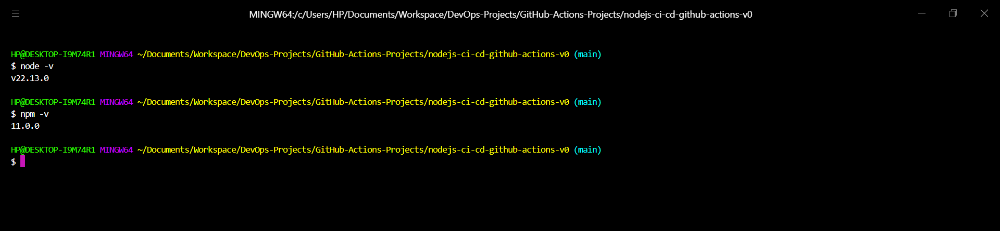
*Verify your development environment has the required tools installed*

---

## 🚀 Step-by-Step Implementation

### **Step 1: Repository Setup**

#### 1.1 Create GitHub Repository
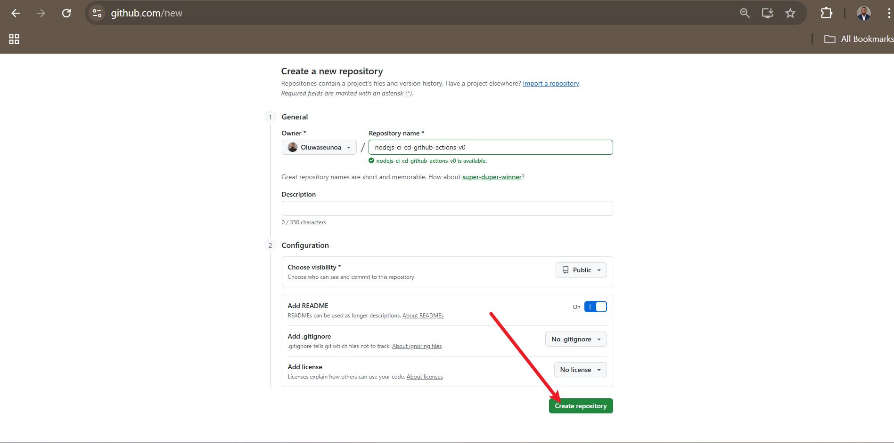
*Initialize a new repository with README enabled*

**Action:** Create repository named `nodejs-ci-cd-github-actions` on GitHub with README file.

#### 1.2 Clone Repository Locally
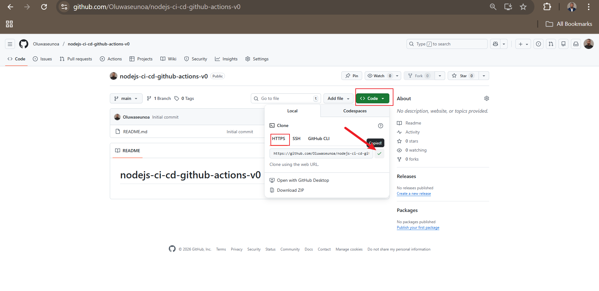
*Obtain the repository HTTPS URL from GitHub*

```bash
git clone https://github.com/your-username/nodejs-ci-cd-github-actions.git
```

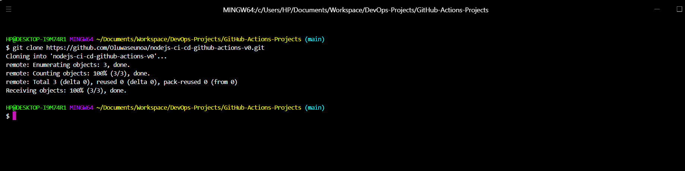
*Execute git clone command in terminal*

#### 1.3 Navigate to Project Directory
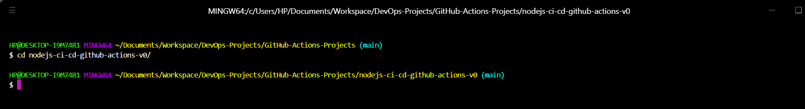
*Change directory into the cloned project*

```bash
cd nodejs-ci-cd-github-actions
```

---

### **Step 2: Node.js Application Setup**

#### 2.1 Initialize Project
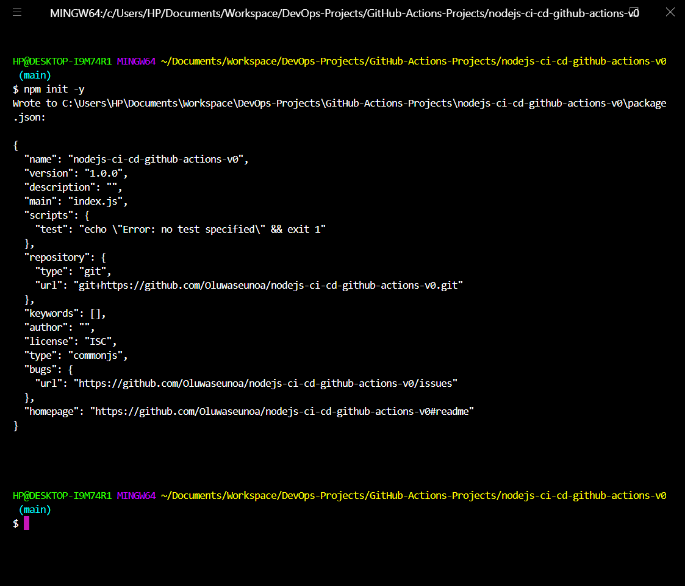
*Create package.json with default settings*

```bash
npm init -y
```

#### 2.2 Install Dependencies
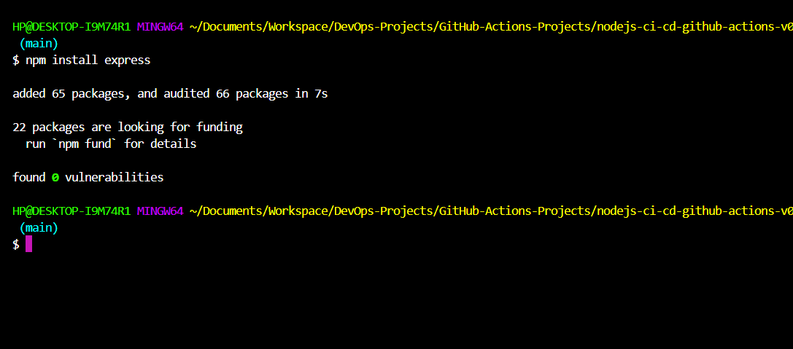
*Add Express.js framework to project*

```bash
npm install express
```

#### 2.3 Create Application File
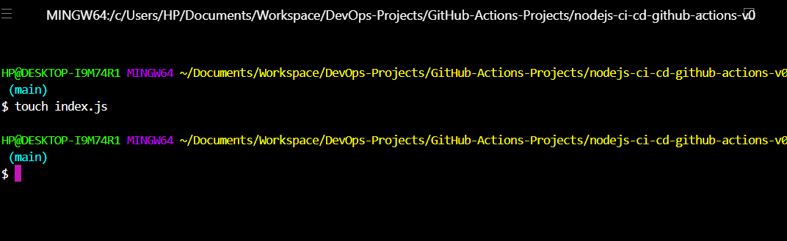
*Initialize the main application file*

```bash
touch index.js
```

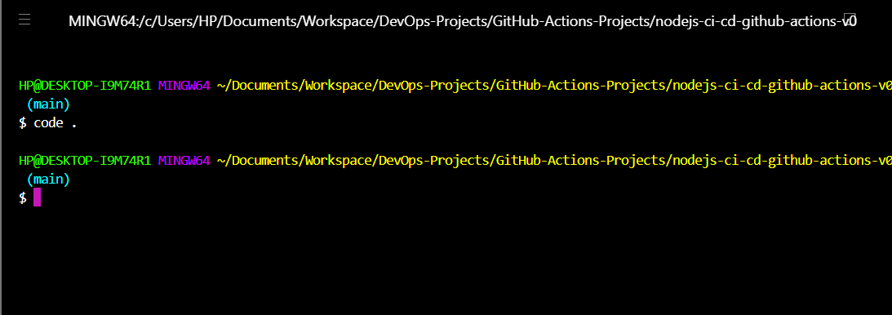
*Open project folder in VS Code for editing*

#### 2.4 Implement Application Code
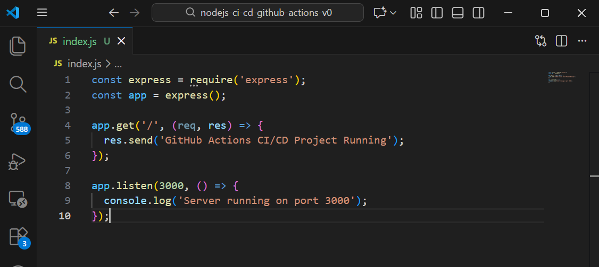
*Implement basic Express.js server*

```javascript
const express = require('express');
const app = express();

app.get('/', (req, res) => {
  res.send('GitHub Actions CI/CD Project Running');
});

app.listen(3000, () => {
  console.log('Server running on port 3000');
});
```

#### 2.5 Configure Package Scripts

*Add build, test, and start scripts to package.json*

```json
"scripts": {
  "start": "node index.js",
  "build": "echo Build successful",
  "test": "echo Tests passed"
}
```

---

### **Step 3: Local Development & Testing**

#### 3.1 Start Application Locally
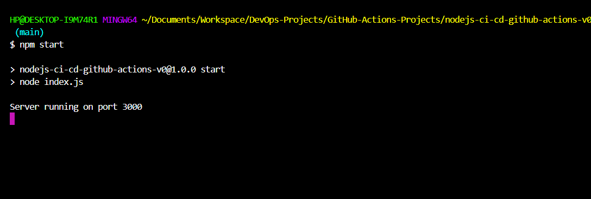
*Launch the Node.js server*

```bash
npm start
```

#### 3.2 Verify Application
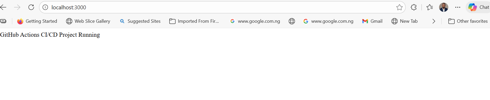
*Confirm application runs on http://localhost:3000*

#### 3.3 Stop Application
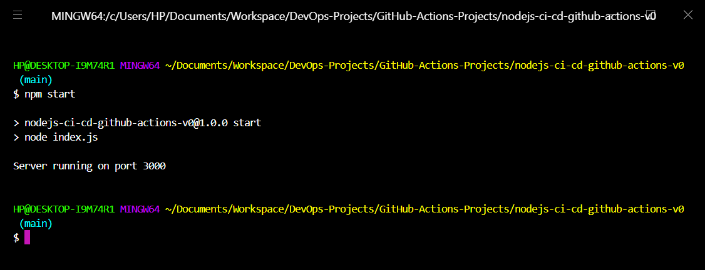
*Terminate the running server*

---

### **Step 4: Version Control Configuration**

#### 4.1 Configure Git Ignore
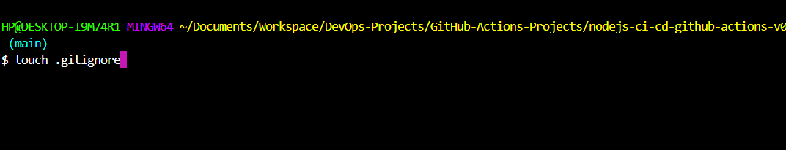
*Initialize git ignore file*

```bash
touch .gitignore
```

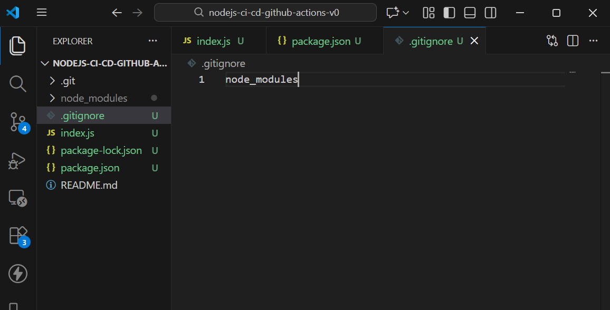
*Exclude node_modules from version control*

```
node_modules
```

#### 4.2 Commit and Push Changes
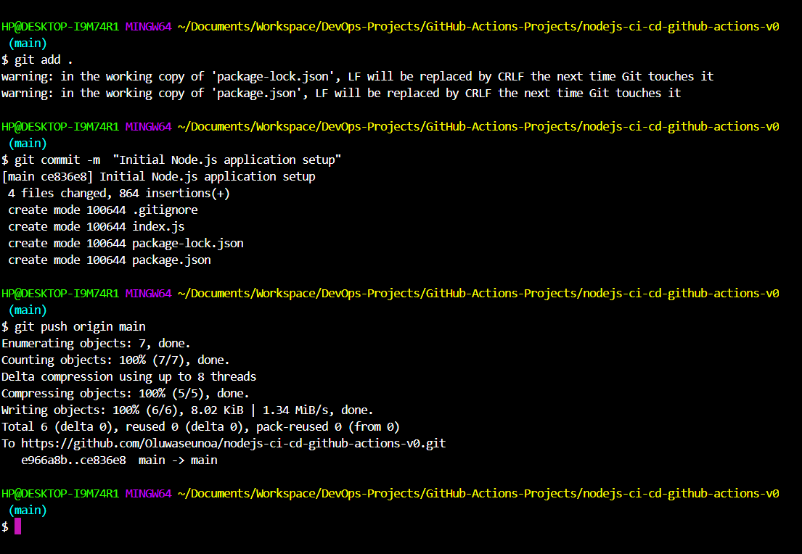
*Stage, commit, and push all changes to remote repository*

```bash
git add .
git commit -m "Initial Node.js application setup"
git push origin main
```

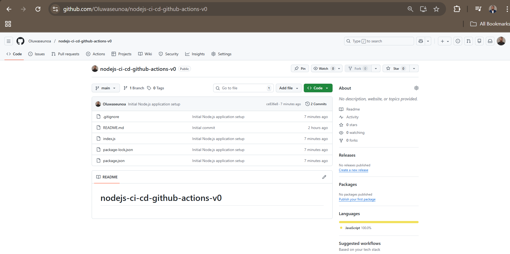
*Verify all files are properly pushed to GitHub repository*

---

### **Step 5: GitHub Actions Workflow Implementation**

#### 5.1 Create Workflow Directory Structure
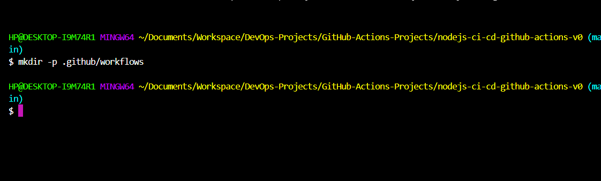
*Set up directory structure for GitHub Actions*

```bash
mkdir -p .github/workflows
```

#### 5.2 Create Workflow File
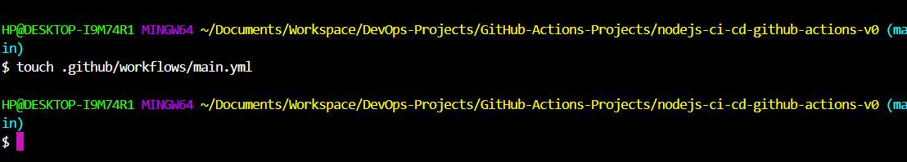
*Initialize the main workflow configuration file*

```bash
touch .github/workflows/main.yml
```

#### 5.3 Define Workflow Structure
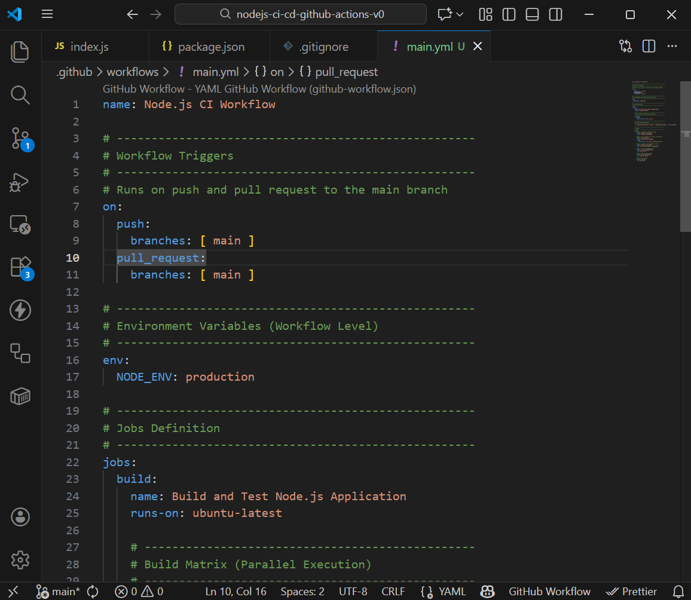
*Begin implementing the CI workflow configuration*

```yaml
name: Node.js CI Workflow
```

#### 5.4 Configure Workflow Triggers
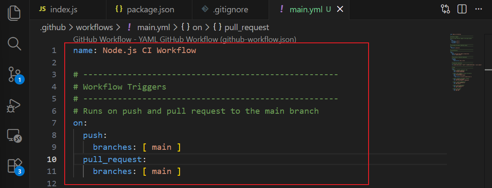
*Define events that initiate the CI pipeline*

```yaml
on:
  push:
    branches: [ main ]
  pull_request:
    branches: [ main ]
```

#### 5.5 Set Environment Variables
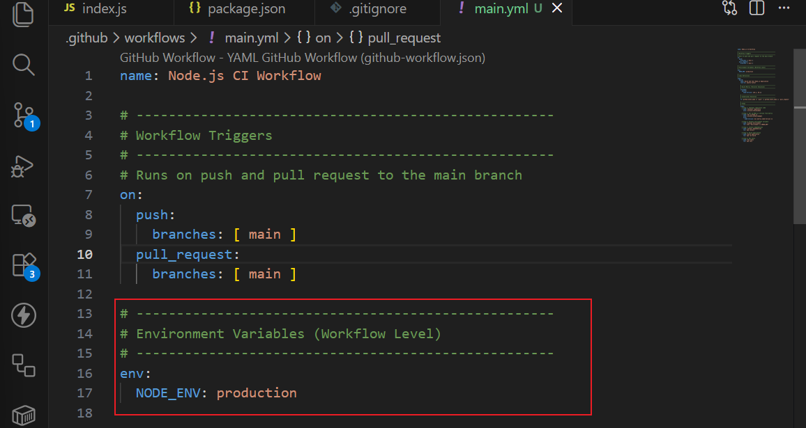
*Configure pipeline environment settings*

```yaml
env:
  NODE_ENV: production
```

#### 5.6 Define Job Configuration
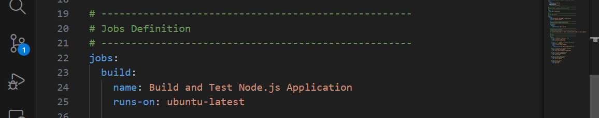
*Specify job name and execution environment*

```yaml
jobs:
  build:
    name: Build and Test Node.js Application
    runs-on: ubuntu-latest
```

#### 5.7 Implement Build Matrix
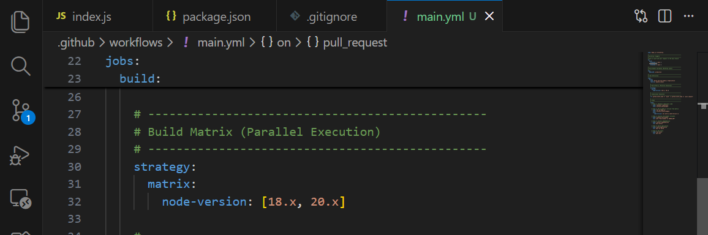
*Configure parallel testing across multiple Node.js versions*

```yaml
strategy:
  matrix:
    node-version: [18.x, 20.x]
```

#### 5.8 Add Conditional Execution
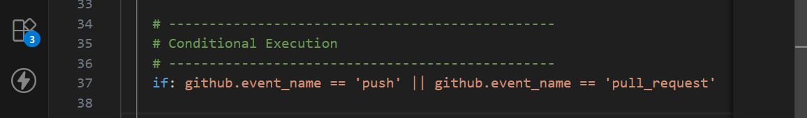
*Implement conditional workflow execution rules*

```yaml
if: github.event_name == 'push' || github.event_name == 'pull_request'
```

#### 5.9 Define Pipeline Steps (Part 1)
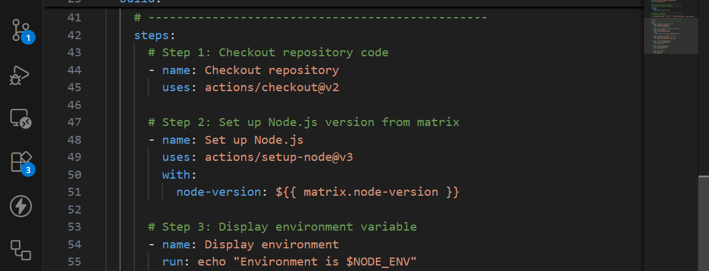
*Repository checkout, Node.js setup, and environment verification*

```yaml
steps:
      # Step 1: Checkout repository code
      - name: Checkout repository
        uses: actions/checkout@v2

      # Step 2: Set up Node.js version from matrix
      - name: Set up Node.js
        uses: actions/setup-node@v3
        with:
          node-version: ${{ matrix.node-version }}

      # Step 3: Display environment variable
      - name: Display environment
        run: echo "Environment is $NODE_ENV"

```

#### 5.10 Define Pipeline Steps (Part 2)
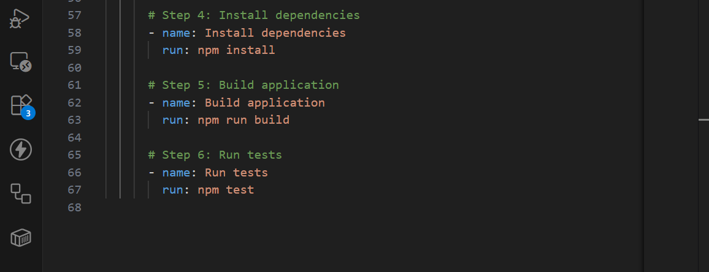
*Dependency installation, build process, and test execution*

```yaml
   # Step 4: Install dependencies
      - name: Install dependencies
        run: npm install

      # Step 5: Build application
      - name: Build application
        run: npm run build

      # Step 6: Run tests
      - name: Run tests
        run: npm test

```

#### 5.11 Deploy Workflow Configuration
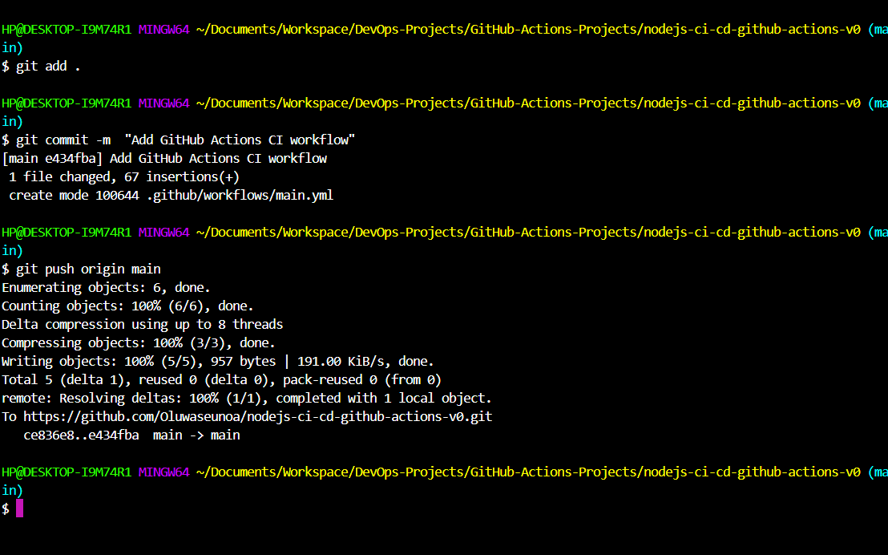
*Push the complete CI workflow to GitHub*

```bash
git add .github/workflows/main.yml
git commit -m "Add GitHub Actions CI workflow"
git push origin main
```

---

### **Step 6: Pipeline Execution & Verification**

#### 6.1 Monitor Workflow Execution
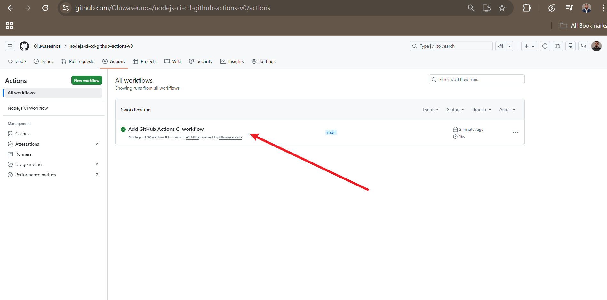
*Access GitHub Actions dashboard to monitor pipeline execution*

#### 6.2 Verify Workflow Completion
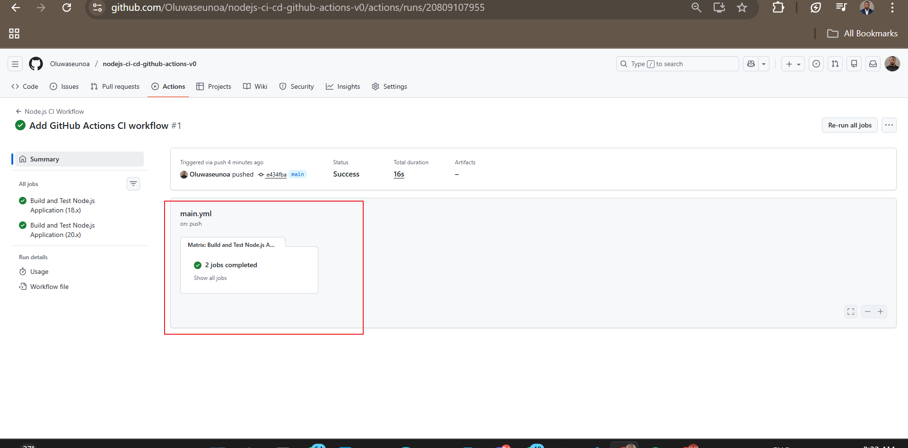
*Confirm successful completion of all workflow jobs*

#### 6.3 Inspect Parallel Execution
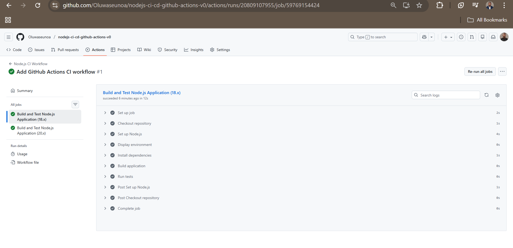
*Review parallel execution results across different Node.js versions*

---

### **Step 7: Branching Strategy & Pull Request Workflow**

#### 7.1 Create Feature Branch
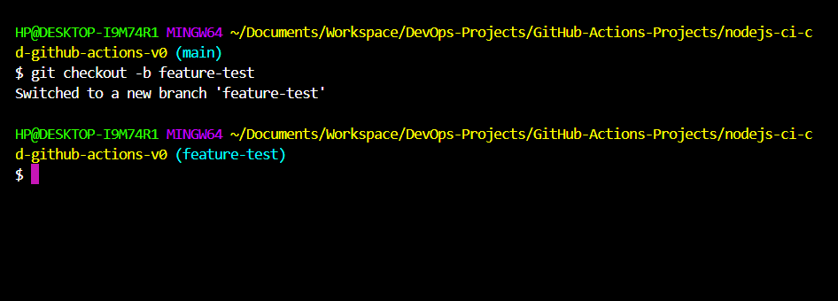
*Isolate new features in a dedicated branch*

```bash
git checkout -b feature-test
```

#### 7.2 Implement Feature Changes
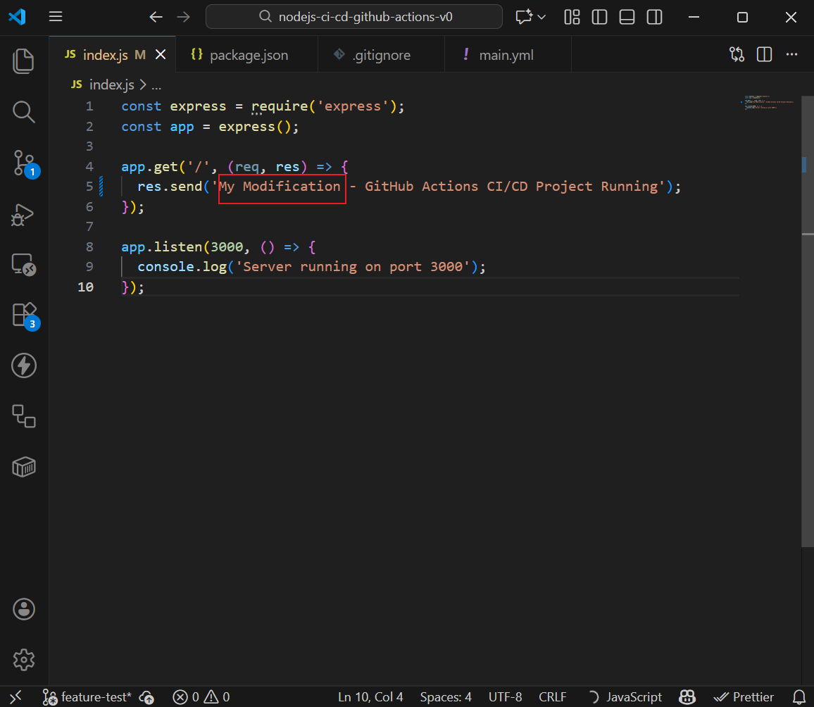
*Make changes to the application code in the feature branch*

#### 7.3 Push Feature Branch
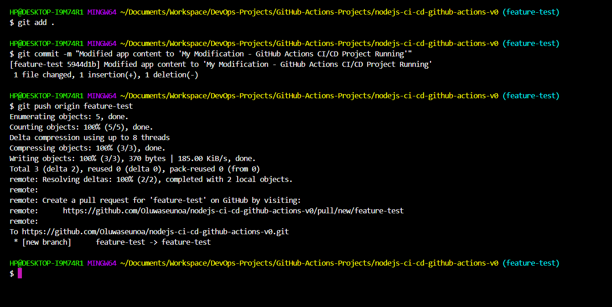
*Upload feature branch to remote repository*

```bash
git add .
git commit -m "Add new feature"
git push origin feature-test
```

#### 7.4 Switch to Feature Branch on GitHub
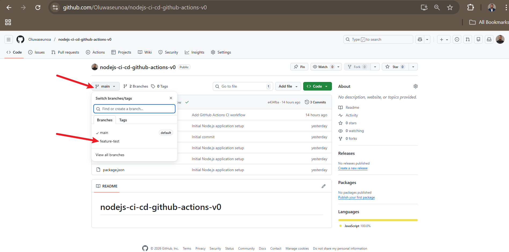
*Navigate to the feature branch in GitHub web interface*

#### 7.5 Initiate Pull Request

*Begin the pull request creation process*


*Compare changes between branches and initiate PR*

#### 7.6 Configure Pull Request Details
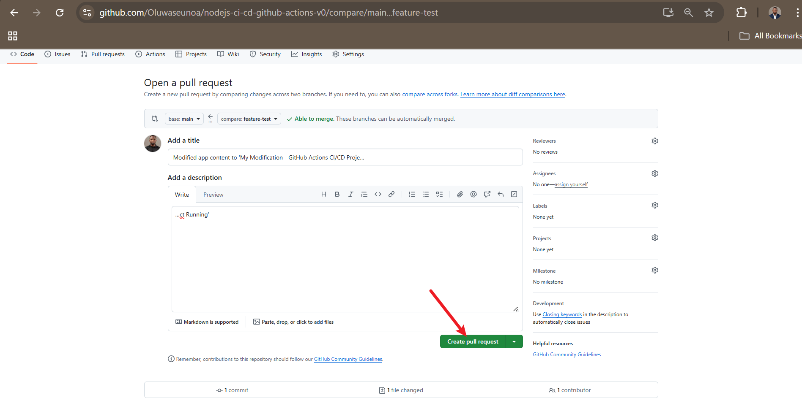
*Provide descriptive title and context for the pull request*

#### 7.7 Monitor PR-triggered Workflow
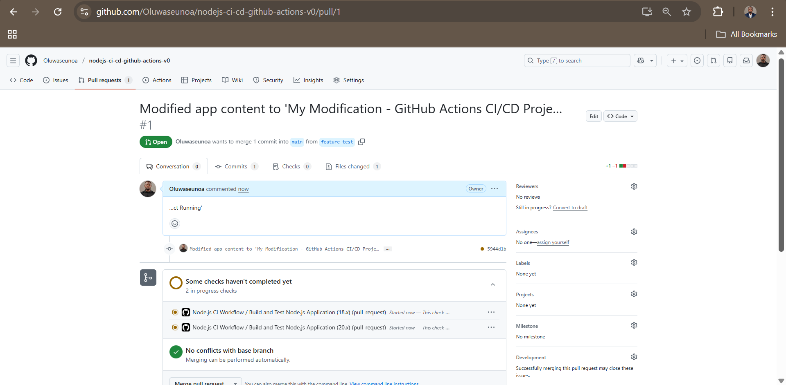
*Verify CI pipeline automatically runs for pull request validation*

#### 7.8 Review Test Results
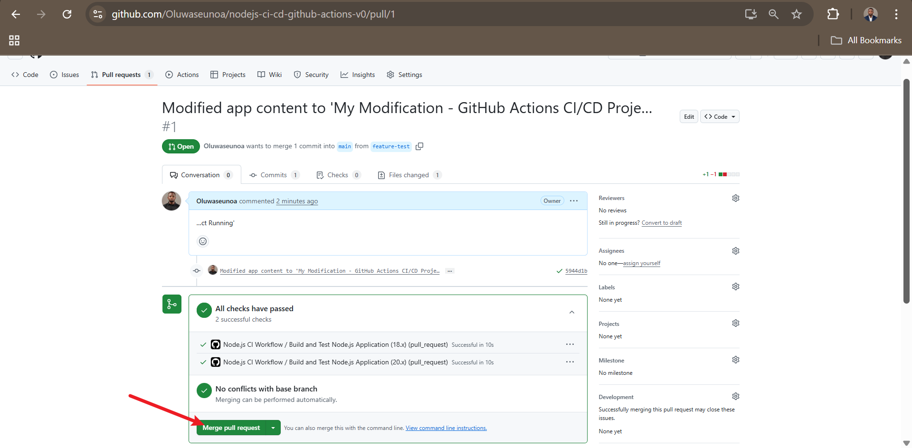
*Confirm all automated checks pass before merging*

#### 7.9 Execute Merge
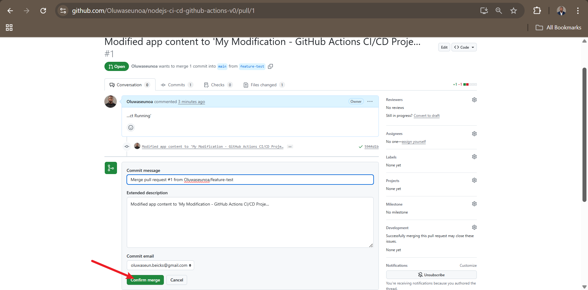
*Proceed with merging feature branch into main*


*Verify successful completion of merge operation*

---

### **Step 8: Post-Merge Verification**

#### 8.1 Synchronize Local Repository
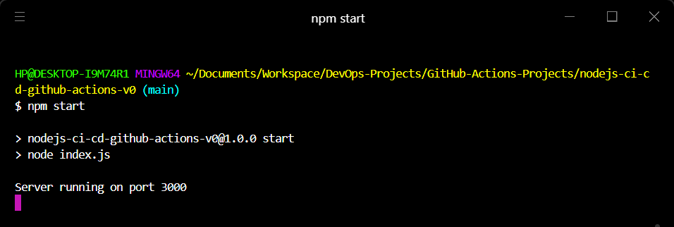
*Update local repository with merged changes*

```bash
git checkout main
git pull origin main
npm start
```

#### 8.2 Verify Updated Application
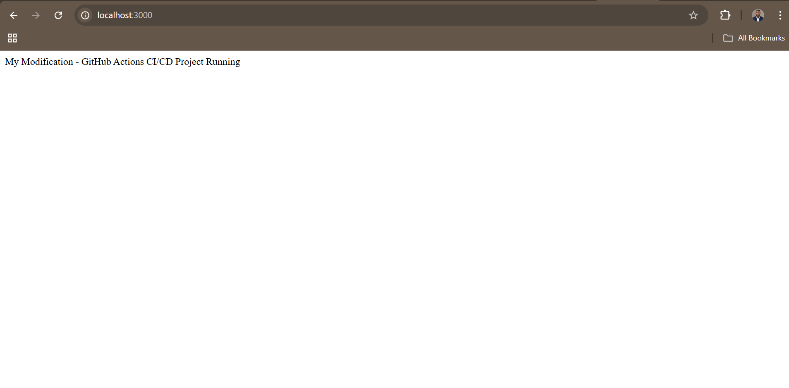
*Confirm application runs successfully with latest changes*

---

## 📊 Key Features Demonstrated

### ✅ Core CI/CD Principles
- **Automated Testing**: Tests run on every push and pull request
- **Build Validation**: Verification of application build process
- **Parallel Execution**: Simultaneous testing across multiple environments
- **Quality Gates**: Automated checks before merge approvals

### ✅ Technical Implementation
- **YAML Configuration**: Proper syntax and structure
- **Environment Management**: Variable configuration and usage
- **Matrix Strategy**: Cross-version compatibility testing
- **Conditional Logic**: Smart pipeline execution rules

### ✅ Development Workflow
- **Branch Protection**: PR requirements before merging
- **Automated Validation**: Continuous integration checks
- **Deployment Readiness**: Production environment preparation
- **Team Collaboration**: Structured code review process

---

## 🏆 Learning Outcomes

### Technical Skills Developed
1. **GitHub Actions Mastery**: Complete workflow design and implementation
2. **CI/CD Pipeline Design**: End-to-end automation strategy
3. **Quality Assurance**: Automated testing integration
4. **DevOps Practices**: Infrastructure as code principles

### Professional Competencies
- Industry-standard development workflows
- Collaborative coding practices
- Automated quality control processes
- Production-ready deployment pipelines

---

## 🔧 Complete Workflow Configuration

```yaml
name: Node.js CI Workflow

# ----------------------------------------------------
# Workflow Triggers
# ----------------------------------------------------
# Runs on push and pull request to the main branch
on:
  push:
    branches: [ main ]
  pull_request:
    branches: [ main ]

# ----------------------------------------------------
# Environment Variables (Workflow Level)
# ----------------------------------------------------
env:
  NODE_ENV: production

# ----------------------------------------------------
# Jobs Definition
# ----------------------------------------------------
jobs:
  build:
    name: Build and Test Node.js Application
    runs-on: ubuntu-latest

    # ------------------------------------------------
    # Build Matrix (Parallel Execution)
    # ------------------------------------------------
    strategy:
      matrix:
        node-version: [18.x, 20.x]

    # ------------------------------------------------
    # Conditional Execution
    # ------------------------------------------------
    if: github.event_name == 'push' || github.event_name == 'pull_request'

    # ------------------------------------------------
    # Steps
    # ------------------------------------------------
    steps:
      # Step 1: Checkout repository code
      - name: Checkout repository
        uses: actions/checkout@v2

      # Step 2: Set up Node.js version from matrix
      - name: Set up Node.js
        uses: actions/setup-node@v3
        with:
          node-version: ${{ matrix.node-version }}

      # Step 3: Display environment variable
      - name: Display environment
        run: echo "Environment is $NODE_ENV"

      # Step 4: Install dependencies
      - name: Install dependencies
        run: npm install

      # Step 5: Build application
      - name: Build application
        run: npm run build

      # Step 6: Run tests
      - name: Run tests
        run: npm test

```

---

## 📈 Portfolio Readiness

This project demonstrates comprehensive CI/CD implementation skills suitable for:
- **Developer Portfolios**: Showcases modern DevOps practices
- **Technical Interviews**: Demonstrates pipeline automation expertise
- **Project Documentation**: Provides clear, step-by-step implementation guide
- **Team Knowledge Sharing**: Serves as educational resource for development teams

---

## 🎯 Project Validation Checklist

- [x] Proper YAML syntax and indentation
- [x] Correct workflow file location (.github/workflows/)
- [x] Automated build and test execution
- [x] Matrix build implementation
- [x] CI triggering on push and pull request events
- [x] Node.js project integration
- [x] Environment variable configuration
- [x] Conditional execution logic
- [x] Complete documentation with screenshots
- [x] Portfolio-ready presentation

---

## 📚 Additional Resources

- [GitHub Actions Documentation](https://docs.github.com/en/actions)
- [Node.js Best Practices](https://nodejs.org/en/docs/guides/)
- [Express.js Framework](https://expressjs.com/)
- [Continuous Integration Patterns](https://martinfowler.com/articles/continuousIntegration.html)

---

**Project Status**: ✅ Complete    
**GitHub Repository**: [nodejs-ci-cd-github-actions](https://github.com/Oluwaseunoa/nodejs-ci-cd-github-actions-v0)  
**Author**: Oluwaseun Osunsola
**License**: MIT

---

*This project serves as a comprehensive demonstration of modern CI/CD practices using GitHub Actions, suitable for both learning and professional portfolio presentation.*